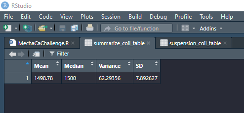
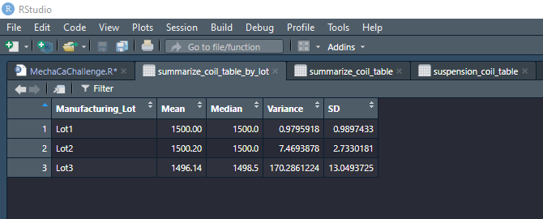
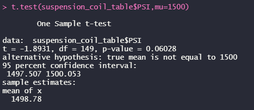
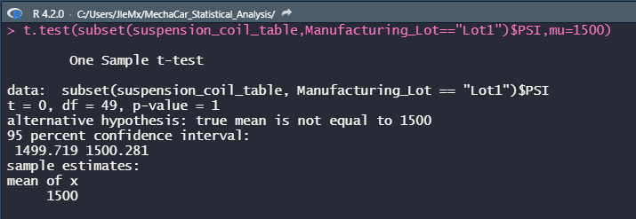
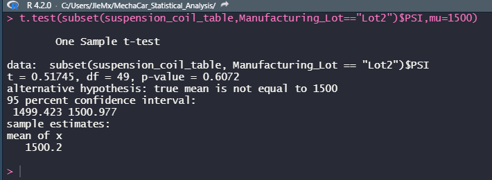
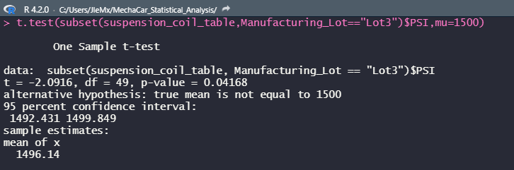

# MechaCar Statistical Analysis
## Linear Regression to Predict MPG
### Questions to be answered
- Which variables/coefficients provided a non-random amount of variance to the mpg values in the dataset?
	- The Vehicle Length has a p-value of 2.6e-12, significantly less than .05 indicating it provides a non-random amount of variance.
	- The Ground Clearance has a p-value of 5.21e-08, significantly less than .05 indicating it provides a non-random amount of variance.

- Is the slope of the linear model considered to be zero? Why or why not?
	- No.
	- The p-value for the model is 5.35e-11, much less than .05 which is sufficient to reject the null hypothesis, this means the slope is not zero.
	
- Does this linear model predict mpg of MechaCar prototypes effectively? Why or why not?
	- Yes.
	- The r-squared is .71 with a p-value that is considered to be significant at 5.35e-11.

## Summary Statistics on Suspension Coils

- The design specifications for the MechaCar suspension coils dictate that the variance of the suspension coils must not exceed 100 pounds per square inch. Does the current manufacturing data meet this design specification for all manufacturing lots in total and each lot individually? Why or why not?
    - When considered in total, the current manufacturing data indicates the design specifications are being met with a variance of 62 psi.
    - When considered individually, the current manufacturing data indicates the design specifications are being met by Lots 1 and 2 with variances of .98 psi and 7.57 psi respectively. However, Lot 3 exceeds the specifications by 70 psi with a variance of 170.29 psi.

	
## T-Tests on Suspension Coils

- The p-value for the population t-test against a mean of 1500 is .06. Being above the .05 significance level, the data population as a whole is statistically similar to 1500.

- The p-value for Lot1 t-test against a mean of 1500 is 1. Being above the .05 significance level, the data is statistically similar to 1500.

- The p-value for Lot2 t-test against a mean of 1500 is .61. Being above the .05 significance level, the data is statistically similar to 1500.

- The p-value for Lot3 t-test against a mean of 1500 is .04. Being below the .05 significance level, the data is not statistically similar to 1500.

## Study Design: MechaCar vs Competition

    In an effort to determine how MechaCar stands up to it's competition, a statistical study can be performed.
    
The metrics to focus on should be as follows:
- Highway miles per gallon
- City miles per gallon
- Delivered price
- Carbon footprint
    
The null hypothesis would be:
- There is no statistical difference between the MechaCar data and the competition
    
The tests to be used would be:
- Multiple linear regression with summary
    -   Useful when using multiple independent variables as well assessing the impact of each variable
- One sample t-test on each metric
    - This will ensure that, if there are metrics that just don't stack up to the competition, they can be clearly identified and easily determined the severity of disparity.
        
The data required would be as follows:
- The millage, both city and highway for each competitor model to be compared.
- The delivered price for each competitor model to be compared.
- Carbon footprint for each competitor model to be compared. Note: this may not be available for all manufacturers as not all of the competition is as far along as MechaCar in their environmental stewardship.    
